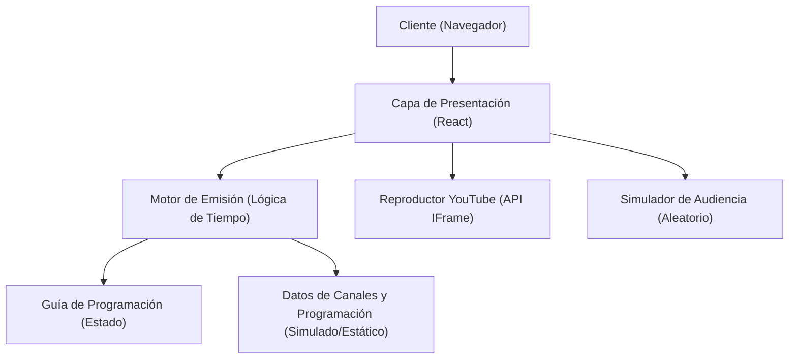
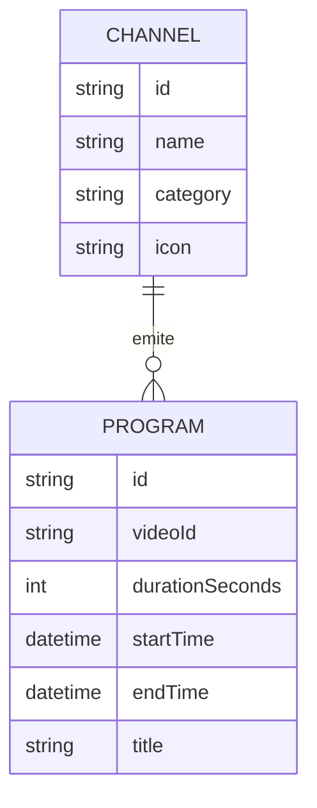

## 1. Diseño de Arquitectura

## 2. Descripción Tecnológica
- **Frontend**: React 18 + Vite + TailwindCSS 3 (TypeScript recomendado)
- **Gestión de Estado**: Zustand o Context API de React para manejar el estado del reproductor y la selección de canal.
- **Reproductor de Video**: `react-player` o carga directa del SDK de YouTube IFrame API para mayor control de `startSeconds` y manipulación del reproductor.
- **Iconos**: Lucide React para botones y logos genéricos de canales.
- **Fechas y Tiempos**: `date-fns` para cálculos precisos de la parrilla (simular emisiones en base al tiempo actual `Date.now()`).

## 3. Definiciones de Rutas
| Ruta | Propósito |
|------|-----------|
| / | Reproductor principal y experiencia TV "en vivo" a pantalla completa |

## 4. Definiciones de API (Si hubiera backend)
Para esta primera versión (MVP), no habrá backend. Los datos de canales y la programación de las 24 horas se generarán estáticamente y se calcularán en tiempo de ejecución en el cliente para simular una emisión continua.

## 5. Diagrama de Arquitectura del Servidor
(No aplica, aplicación Client-Side Only)

## 6. Modelo de Datos (Simulado en Cliente)
### 6.1 Definición del Modelo de Datos

### 6.2 Lógica de Cálculo de Emisión
Para calcular qué se está emitiendo "ahora" y en qué segundo exacto debe empezar el video de YouTube:
1. Definir una lista de videos de YouTube (con duraciones conocidas) por canal.
2. Usar un `timestamp` ancla (ej. el inicio del día o la medianoche) y sumar consecutivamente las duraciones para generar la "programación" del día (24 horas).
3. Comparar el tiempo actual (`Date.now()`) con la programación para encontrar el `PROGRAM` actual.
4. El tiempo de inicio en YouTube (`startSeconds`) se calcula como: `Date.now() - PROGRAM.startTime`.
5. Si un canal se sintoniza, cargar el iframe de YouTube pasando el `videoId` y el `startSeconds` exacto.
6. El contador de espectadores (audiencia) será un número generado aleatoriamente entre rangos plausibles para cada canal, actualizado esporádicamente (ej. +/- 5% cada pocos segundos).
